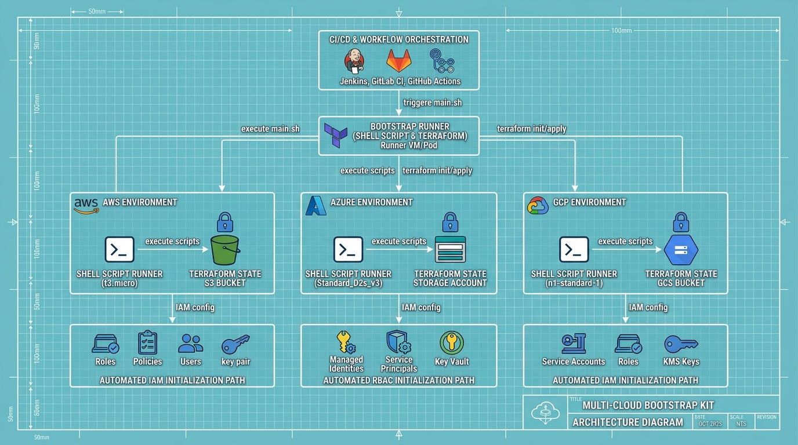
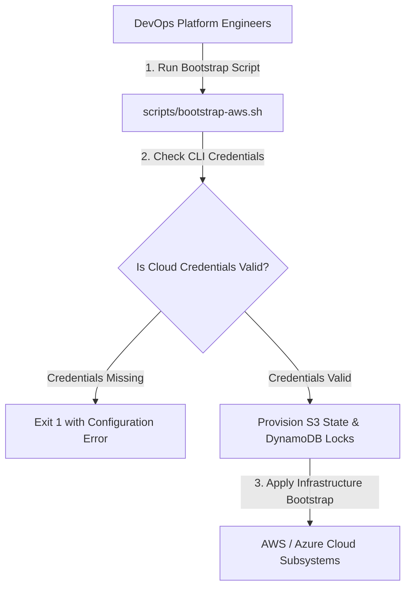

<div align="center">


# cloud-bootstrap-kit

### Multi-Cloud Infrastructure & Terraform State Bootstrap Automation Kit

[](https://devopstrio.co.uk)
[](https://gnu.org/software/bash)
[](https://terraform.io)

</div>

---

## ⚡ Technical Overview & Kit Scope

The **Cloud Bootstrap Kit** provides production-grade automation scripts and Terraform templates for initializing multi-cloud enterprise environments (AWS, Azure, GCP).

It automates initial Terraform state storage bucket creation, DynamoDB state locking tables, Azure Resource Groups, and GCP Project API enablement across enterprise accounts.

<p align="center">
  
</p>

---

## 📚 Documentation & Architecture Guides

* 📖 **Architecture Specification:** [docs/ARCHITECTURE.md](docs/ARCHITECTURE.md)
* 📘 **Deployment & Integration Guide:** [docs/deployment-guide.md](docs/deployment-guide.md)

---

## 🔄 Bootstrap Execution Flow



---

## 📂 Repository Directory Layout

```
cloud-bootstrap-kit/
├── .github/
│   └── workflows/
│       └── bootstrap-ci.yml     # Bash & Terraform CI validation pipeline
├── docs/
│   ├── ARCHITECTURE.md          # Architecture specification document
│   ├── deployment-guide.md      # Integration & shell execution manual
│   └── images/
│       └── architecture_diagram.jpg # Visual blueprint diagram
├── scripts/
│   ├── bootstrap-aws.sh         # AWS account & region initializer
│   ├── bootstrap-azure.sh       # Azure subscription & tenant initializer
│   ├── bootstrap-gcp.sh         # GCP project & API initializer
│   └── common-utils.sh          # Common logger & helper utilities
├── templates/
│   ├── aws/
│   │   └── bootstrap.tf         # AWS S3 state & DynamoDB lock template
│   └── azure/
│       └── bootstrap.tf         # Azure SA state storage template
├── tests/
│   └── test-scripts.sh          # Shell script integration test suite
├── .gitignore                   # Git ignore file
└── README.md                    # Bootstrap manual documentation
```

---

## 🚀 Quick Start Guide

### 1. Installation & Script Permissions

```bash
# Clone repository
git clone https://github.com/Devopstrio/cloud-bootstrap-kit.git
cd cloud-bootstrap-kit

# Grant execution permissions
chmod +x scripts/*.sh tests/*.sh
```

### 2. Bootstrap AWS Account & State Storage

```bash
./scripts/bootstrap-aws.sh eu-west-1 production
```

### 3. Bootstrap Azure Environment

```bash
./scripts/bootstrap-azure.sh westeurope rg-cloud-bootstrap
```

### 4. Run Shell Integration Test Suite

```bash
bash tests/test-scripts.sh
```

<div align="center">

<sub>&copy; 2026 Devopstrio &mdash; Engineering Uninterrupted Global Workforce Productivity.</sub>

</div>
