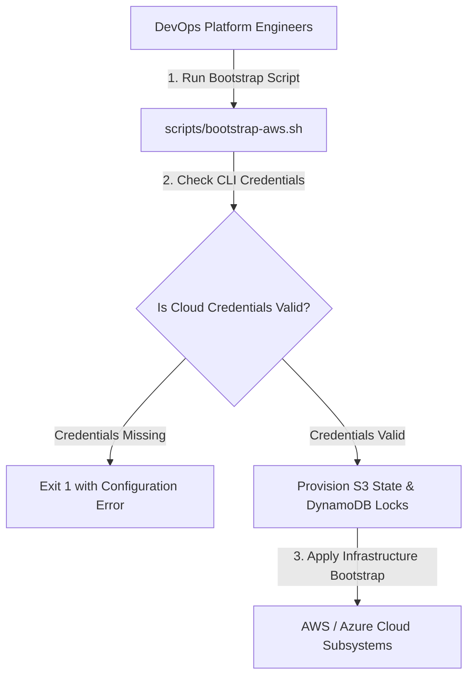

# Multi-Cloud Bootstrap Kit Architecture

The **Cloud Bootstrap Kit** provides automated CLI shell scripts and Terraform state initialization templates for bootstrapping AWS, Azure, and GCP enterprise accounts.

## Component Sequence Diagram

## Core Modules & Script Components

1. **AWS Bootstrap Script (`scripts/bootstrap-aws.sh`)**
   - Initializes AWS region S3 state buckets and DynamoDB state lock tables.

2. **Azure Bootstrap Script (`scripts/bootstrap-azure.sh`)**
   - Initializes Azure Resource Groups and Blob storage accounts for Terraform state.

3. **GCP Bootstrap Script (`scripts/bootstrap-gcp.sh`)**
   - Enables core GCP Cloud APIs and sets up Organization projects.

4. **Terraform Bootstrap Templates (`templates/`)**
   - Production HCL state storage templates (`templates/aws/bootstrap.tf`, `templates/azure/bootstrap.tf`).
